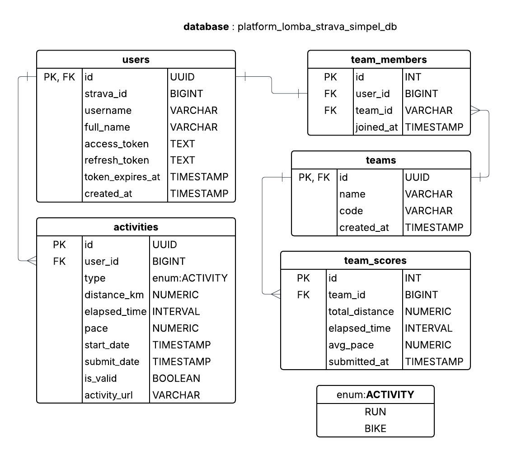

# platform-lomba-strava-simpel

Sebuah platform (web) lomba sederhana yang berinteraksi dengan ekosistem Strava (via API) berbasis bahasa pemrograman Python

## Desain

### Desain Database

#### Uraian Tabel

##### `users`

Individu peserta yang login dengan akun Strava.

| Kolom                | Tipe Data    | Keterangan                    |
| ------------------   | ----------   | ----------------------------- |
| `id`                 | `UUID`       | Primary Key                   |
| `strava_id`          | `BIGINT`     | ID dari Strava                |
| `username`           | `VARCHAR`    | Nama tampilan                 |
| `full_name`          | `VARCHAR`    | Nama lengkap                  |
| `access_token`       | `TEXT`       | Token OAuth untuk akses API   |
| `refresh_token`      | `TEXT`       | Token untuk refresh           |
| `token_expires_at`   | `TIMESTAMP`  | Token expiry time             |
| `created_at`         | `TIMESTAMP`  | Timestamp saat user terdaftar |

##### `teams`

tim tempat peserta bergabung pada lomba.

| Kolom         | Tipe Data    | Keterangan                       |
| ------------  | ----------   | -------------------------------- |
| `id`          | `UUID`       | Primary Key                      |
| `name`        | `VARCHAR`    | Nama tim                         |
| `code`        | `VARCHAR`    | Kode unik  untuk join ke tim     |
| `created_at`  | `TIMESTAMP`  | Tanggal dibuat                   |

##### `team_members`

Tabel penghubung untuk menyatakan relasi _many-to-many_ antara `users` dan `teams`.

| Kolom        | Tipe Data    | Keterangan             |
| ----------   | ----------   | ---------------------- |
| `id`         | `INT`        | Primary Key            |
| `user_id`    | FK → `users` | Peserta                |
| `team_id`    | FK → `teams` | Tim                    |
| `joined_at`  | `TIMESTAMP`  | Waktu bergabung ke tim |

##### `activities`

Aktivitas dari Strava (run, bike). Berisi detail informasi performa seperti jarak, waktu aktivitas, pace, dan lain-lain.

| Kolom                | Tipe Data     | Keterangan                              |
| ------------------   | -----------   | --------------------------------------- |
| `id`                 | `BIGINT`      | ID dari Strava (unik global)            |
| `user_id`            | FK → `users`  | Pemilik aktivitas                       |
| `type`               | `VARCHAR`     | Jenis aktivitas (Run, Ride, Swim, Hike) |
| `distance_km`        | `NUMERIC`     | Jarak dalam kilometer                   |
| `elapsed_time`       | `INT` (detik) | Waktu bergerak                          |
| `pace`               | `NUMERIC`     | Pace (jika applicable, misal untuk Run) |
| `start_date`         | `TIMESTAMP`   | Tanggal dan waktu mulai aktivitas       |
| `submit_date`        | `TIMESTAMP`   | Waktu aktivitas diambil                 |
| `is_valid`           | `BOOLEAN`     | Untuk keperluan validasi manual/admin   |
| `activity_url`       | `VARCHAR`     | Link menuju aktivitas stravanya         |

##### `team_scores`

hasil agregat perolehan performa dari seluruh anggota tim.

| Kolom            | Tipe Data           | Keterangan                          |
| ---------------  | -----------------   | ----------------------------------- |
| `id`             | `INT`               | Primary Key                         |
| `team_id`        | FK → `teams`        | Tim                                 |
| `total_distance` | `NUMERIC`           | Total jarak                         |
| `elapsed_time`   | `NUMERIC`           | Total waktu aktivitas               |
| `avg_pace`       | `NUMERIC`           | Rata-rata pace tim untuk total 20km |
| `submitted_at`   | `TIMESTAMP`         | Terakhir kali diperbarui            |

## Implementasi

## Pranala

- [SQLAlchemy](https://www.sqlalchemy.org/)
- [flask](https://flask.palletsprojects.com/en/stable/)
- [stravalib](https://github.com/stravalib/stravalib)